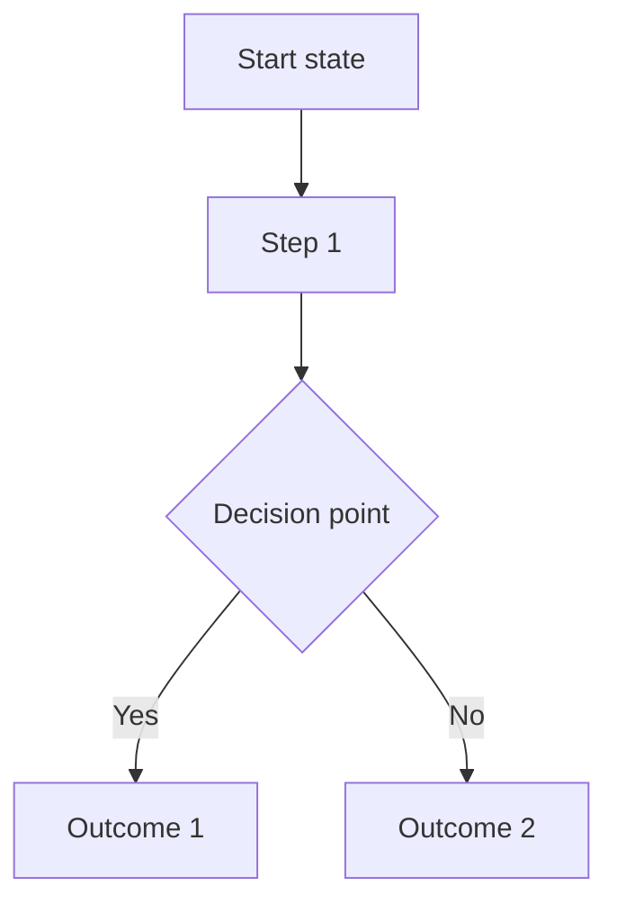
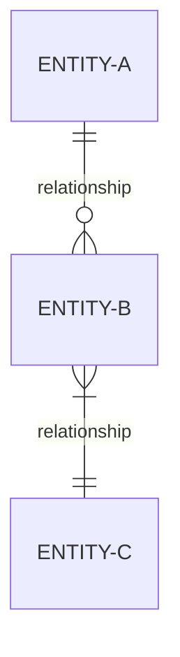
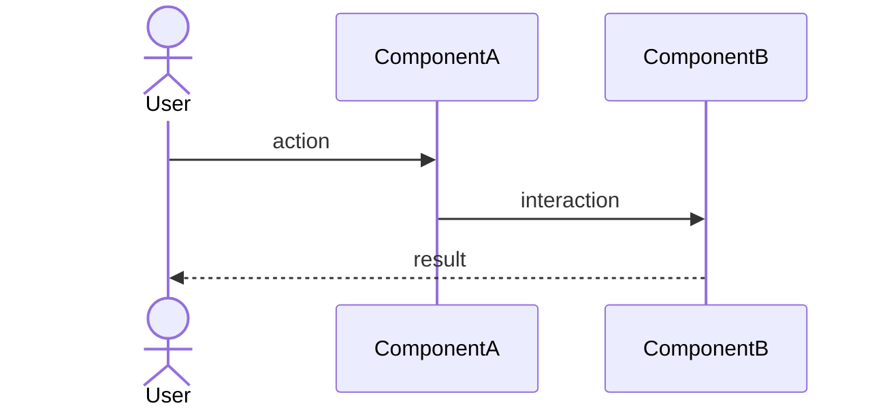

<!-- TEMPLATE RULES:
- Requirements use natural language, not code
- Affected Components lists module/domain names, not file paths
- Entity definitions describe data concepts, not schemas or interfaces
- Acceptance criteria describe observable behavior, not test assertions
- NO code, pseudo-code, or implementation details anywhere in this document
- Visual Overview section is OPTIONAL — delete it if the feature doesn't benefit from diagrams
- Mermaid diagrams describe WHAT happens, not HOW it is implemented
-->

# Feature: {TICKET-ID} - {Title}

## Ticket ID
{TICKET-ID}

## Summary
{1-2 sentence overview: what capability is being added and who benefits}

## Problem Statement
{Describe the current pain point or gap. Who experiences it and what is the impact?}

## Visual Overview
<!-- OPTIONAL: Include mermaid diagrams only when they add clarity to the feature.
     Delete this entire section if the feature is simple enough to understand without diagrams.
     Use whichever diagram types are relevant — you don't need all of them. -->

<!-- Process Flow — use when the feature involves a multi-step process or state transitions -->

<!-- Entity Relationships — use when new data concepts relate to existing ones -->

<!-- Component Interactions — use when multiple modules or services communicate -->

## Requirements

### Functional Requirements
- {The system shall... [describe observable behavior]}
- ...

### Non-Functional Requirements
- {Performance, reliability, scalability, or compatibility expectations}
- ...

## Constraints
- {Business rules that limit the solution space}
- {Technical boundaries from existing architecture}
- {Timeline or resource limitations}

## Affected Components
- **{component/module-1}** - {What changes here}
- **{component/module-2}** - {What changes here}
- **{component/module-3}** - {What changes here}
- ...

## Entity/Component Definitions

### {EntityName} (if applicable)
<!-- Describe the data CONCEPT, not the implementation. No TypeScript, no SQL. -->
| Field | Type | Required | Description |
|-------|------|----------|-------------|
| id | {Entity}Id | Yes | Unique identifier |
| name | String | Yes | Entity name |
| ... | ... | ... | ... |

### Business Rules
- {Rule 1}
- {Rule 2}
- ...

## Acceptance Criteria
- [ ] {Observable behavior that proves this requirement is met}
- [ ] {Observable behavior that proves this requirement is met}
- [ ] {Observable behavior that proves this requirement is met}
- ...

## Alternatives Considered

### Option 1: {Alternative approach}
**Pros:** {Benefits}
**Cons:** {Drawbacks}
**Decision:** Rejected because {reason}

### Option 2: {Another alternative}
**Pros:** {Benefits}
**Cons:** {Drawbacks}
**Decision:** Rejected because {reason}

### Chosen Approach: {Selected approach}
**Rationale:** {Why this approach was chosen}

## Decisions

<!-- Record key decisions from the spec discussion.
     Tag each with exactly one of: [DECIDED], [FLEXIBLE], [DEFERRED]
     - [DECIDED]: Locked — Phase 2 planner and Phase 3 agents MUST honor exactly
     - [FLEXIBLE]: Claude's discretion — planner chooses the best approach
     - [DEFERRED]: Out of scope — planner MUST NOT include in the plan
-->

### {Topic: brief description of what was decided}
**Context:** {Why this decision came up}
**Decision:** {What was decided} **[DECIDED]**

### {Topic: area left to implementer's discretion}
**Context:** {What was discussed}
**Decision:** {General direction, implementer chooses specifics} **[FLEXIBLE]**

### {Topic: explicitly deferred item}
**Context:** {Why it was raised}
**Decision:** {Not addressing now — reason} **[DEFERRED]**

## Next Steps
After approval:
1. Run `/clear` to reset context
2. Run `/5:plan-implementation {TICKET-ID}-{description}`
