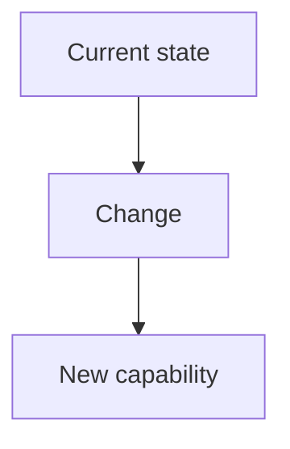

<!-- TEMPLATE RULES:
- Write naturally
- Reference existing classes, modules, and patterns by name for precision
- Entity definitions include field names and domain types
- Acceptance criteria describe observable behavior
- No code blocks, no pseudo-code, no class hierarchy designs
- Delete any OPTIONAL section that doesn't add value for this feature
-->

# Feature: {TICKET-ID} - {Title}

**Ticket:** {TICKET-ID}

## Overview

{What is the problem or gap, and what capability is being added? Write this as a short narrative
that covers who is affected, why the change matters, and what the end result looks like.}

<!-- OPTIONAL: Include mermaid diagrams only when they add clarity.
     Delete this section for simple features. Use whichever diagram type fits. -->

## What Changes

{Describe what the feature does in natural, flowing prose. Name existing classes, modules, and patterns
where relevant. Group by logical concern, not by module layer. Each subsection should tell the reader
what happens and which parts of the codebase are involved.}

### {Logical concern 1, e.g., "New data model"}

{Describe the change. Name affected modules and classes. If a new entity is introduced, describe its
fields and types in a table:}

| Field | Type | Required | Description |
|-------|------|----------|-------------|
| ... | ... | ... | ... |

### {Logical concern 2, e.g., "CRUD operations"}

{Describe the behavior. Reference existing patterns to follow, e.g.,
"Follow the same approach as the UserService update flow."}

### {Logical concern 3, e.g., "API exposure"}

{Describe what gets exposed and how.}

### Business Rules

- {Rule 1}
- {Rule 2}

## Existing Patterns to Follow

{List concrete patterns from the codebase that the implementation should mirror.
These are high-value pointers for Phase 2 -- be specific.}

- **{Pattern name}** -- {where it lives and what to reuse from it}
- ...

## Constraints

- {Business rules that limit the solution space}
- {Technical boundaries from existing architecture}

## Scope

**In scope:**
- {What is included}

**Out of scope:**
- {What is explicitly excluded and why}

## Acceptance Criteria

- [ ] {Observable behavior that proves a requirement is met}
- [ ] ...

## Decisions

<!-- Tag each: [DECIDED] = locked, [FLEXIBLE] = planner chooses, [DEFERRED] = not in this iteration -->

- **{Topic}:** {What was decided and why} **[DECIDED]**
- **{Topic}:** {General direction, planner chooses specifics} **[FLEXIBLE]**
- **{Topic}:** {Not addressing now -- reason} **[DEFERRED]**

<!-- OPTIONAL: Only include if alternatives were genuinely discussed and the reasoning matters -->
## Alternatives Considered

- **{Alternative}:** Rejected because {reason}
- **{Chosen approach}:** Selected because {reason}

## Next Steps

1. Run `/clear` to reset context (optional)
2. Run `/5:plan-implementation {TICKET-ID}-{description}`
